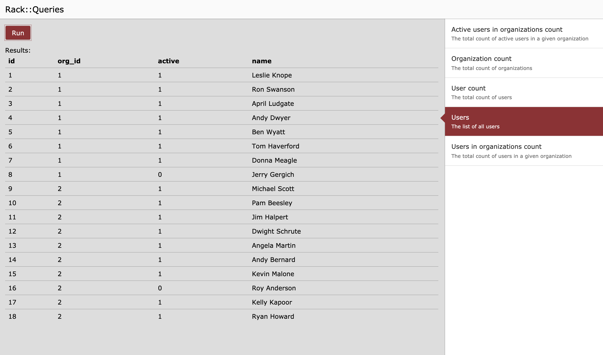

# Rack::Queries

[](https://github.com/CultureHQ/rack-queries/actions)
[](https://github.com/CultureHQ/rack-queries)

This gem provides a page in your rack-based (e.g., `Rails`, `Sinatra`) application that allows quick execution of pre-built queries. The goal is to allow quick insights into the state of your application without needing to update the main UI. Consider it a backdoor admin page that you can use before you decide to truly expose query results.



## Usage

First, add `rack-queries` to your Gemfile and `bundle install`. Then, mount the `Rack::Queries::App` application within your app.

Within Rails, that will look like (within `config/routes.rb`):

```ruby
Rails.application.routes.draw do
  mount Rack::Queries::App, at: '/queries'
end
```

Then, you can go to `/queries` within your application to view the empty queries page.

Second, define the queries that you want included on your query page. Queries are classes that respond to `run(opts)`. The `run` method should return either a single value or an array of arrays (in the UI it will either display one value or a table). The following example returns an overall count:

```ruby
class UserCountQuery
  def run(_opts)
    User.count
  end
end
```

If you want your queries to have arguments (say for instance that users can be scoped to organizations), you define public instance methods on your query class:

```ruby
class UserPerOrgCountQuery
  def org
    Org.order(:name).pluck(:name)
  end

  def run(opts)
    Org.where(name: opts['org']).users.count
  end
end
```

Each public instance method is expected to return an array of options (they get transformed into `select` tags in the UI). They are then given to the `run` method through the `opts` hash which contains the value within a string key corresponding to the method name.

Finally, inform `rack-queries` that you want to include the query on your query page by adding it to the list:

```ruby
Rack::Queries.add(
  UserCountQuery,
  UserPerOrgCountQuery
)
```

### Customization

Query objects can optionally have a bit of customization with regard to display through the `::name` and `::desc` methods. Overriding the `::name` method will change the display on the right-hand side, and adding a `::desc` method will add a small paragraph with a description below the name.

### Query DSL

You can create queries manually as described above, or you can use a minimal DSL through the `Rack::Queries::create` method. To recreate the `UserPerOrgCountQuery` as above, you could:

```ruby
Rack::Queries.create do
  name 'UserPerOrgCountQuery'
  desc 'The count of users in each organization'

  opt :org do
    Org.order(:name).pluck(:name)
  end

  run do |opts|
    Org.where(name: opts['org']).users.count
  end
end
```

### Middleware

Since `Rack::Queries` is a rack application, you can add whatever middleware you like into its stack before the request hits the application. For instance, to integrate HTTP basic auth around it to protect the query results, you can use the `Rack::Queries::App::use` method as in:

```ruby
Rack::Queries::App.use(Rack::Auth::Basic) do |username, password|
  compare = lambda { |left, right|
    ActiveSupport::SecurityUtils.secure_compare(
      ::Digest::SHA256.hexdigest(left),
      ::Digest::SHA256.hexdigest(right)
    )
  }

  credentials = Rails.application.credentials

  compare[username, credentials.rack_queries_username] &
    compare[password, credentials.rack_queries_password]
end
```

## Development

After checking out the repo, run `bin/setup` to install dependencies. Then, run `rake test` to run the tests. You can also run `bin/console` for an interactive prompt that will allow you to experiment.

To install this gem onto your local machine, run `bundle exec rake install`. To release a new version, update the version number in `version.rb`, and then run `bundle exec rake release`, which will create a git tag for the version, push git commits and tags, and push the `.gem` file to [rubygems.org](https://rubygems.org).

## Contributing

Bug reports and pull requests are welcome on GitHub at https://github.com/CultureHQ/rack-queries.

## License

The gem is available as open source under the terms of the [MIT License](https://opensource.org/licenses/MIT).
